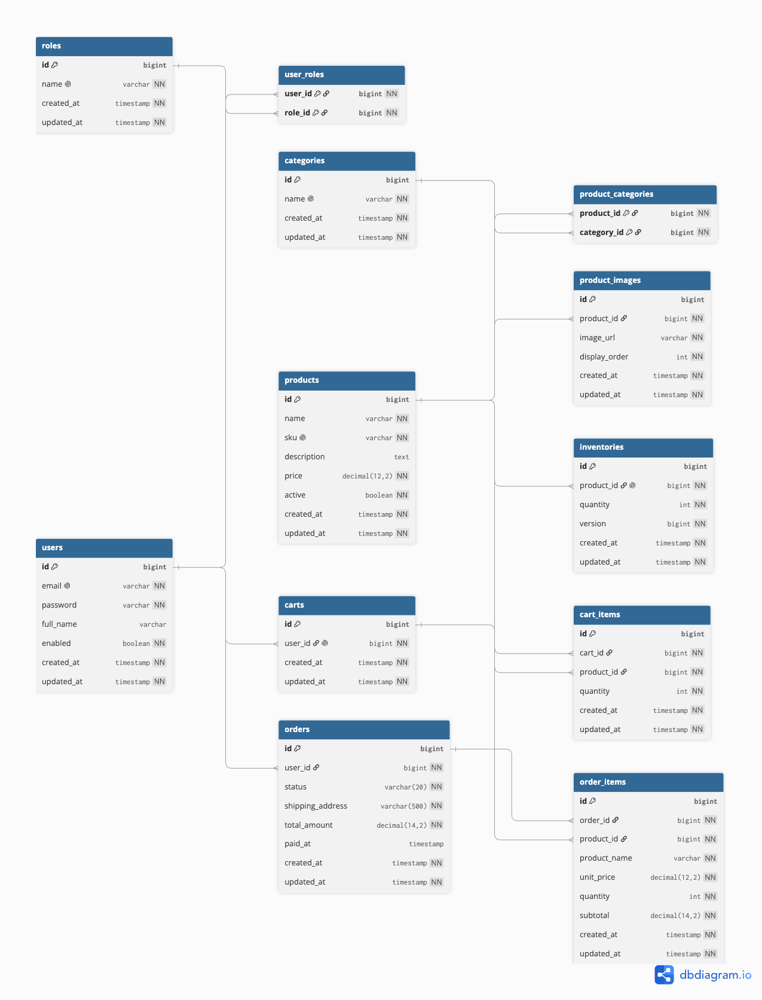

# Ecommerce Backend


Backend ecommerce dạng Modular Monolith: JWT + refresh token qua Redis, cache-aside cho sản phẩm, xử lý đơn hàng qua Kafka, chống overselling bằng optimistic locking. Chạy local bằng `docker compose up`.

## Tính năng

- **Auth & User** — đăng ký/đăng nhập, JWT access + refresh token (Redis, TTL), RBAC, quản lý user (admin).
- **Catalog** — CRUD category/sản phẩm, tìm kiếm + phân trang, cache-aside chi tiết sản phẩm.
- **Cart & Checkout** — giỏ hàng, tạo đơn có idempotency key, thanh toán giả lập, tự huỷ đơn `PENDING` quá hạn.
- **Inventory** — Kafka consumer trừ/hoàn kho, optimistic locking + retry chống overselling.
- **Admin** — quản lý sản phẩm/category/đơn/user/tồn kho, báo cáo doanh thu theo ngày.
- **Khác** — correlation-ID xuyên Kafka, CORS, Swagger, unit test cho toàn bộ service layer.

## Tech Stack

| Layer | Lựa chọn |
|---|---|
| Framework | Java 17, Spring Boot 4.1.1 |
| Database | PostgreSQL 15 + Flyway |
| Cache | Redis 7 |
| Messaging | Kafka 4.0 (KRaft) |
| Bảo mật | Spring Security + JWT |
| API docs | springdoc-openapi |
| Test | JUnit 5, Mockito, AssertJ |
| Hạ tầng | Docker Compose |

## Sơ đồ ERD



## Hướng dẫn chạy

Cần Docker và JDK 17+. Không cần `.env`, `application.yaml` đã khớp sẵn với docker-compose.

```bash
docker compose up -d       # Postgres, Redis, Kafka
./mvnw spring-boot:run     # tự chạy migration + seed data
```

App chạy ở `http://localhost:8080`, Swagger UI ở `/swagger-ui.html`.

Tài khoản admin mẫu: `admin@shop.com` / `Admin@123`. Muốn seed lại từ đầu: `docker compose down -v && docker compose up -d`.

## Chạy test

```bash
./mvnw test
```

## Vấn đề đã gặp & cách xử lý

- **Overselling** — optimistic locking (`@Version`) + retry ở Kafka consumer.
- **Dual-write** — `@TransactionalEventListener(AFTER_COMMIT)`, chỉ bắn event sau khi DB commit.
- **Double-submit đơn hàng** — idempotency key qua Redis `SETNX` + TTL.
- **Đơn hàng bỏ dở giữ tồn kho** — scheduled job tự huỷ đơn `PENDING` quá hạn, mỗi đơn 1 transaction riêng.
- **Cache trả tồn kho cũ** — `quantity` không nằm trong cache, luôn lấy live mỗi request.
- **Trace request qua Kafka** — correlation ID qua MDC + Kafka header, gắn lại ở consumer.
